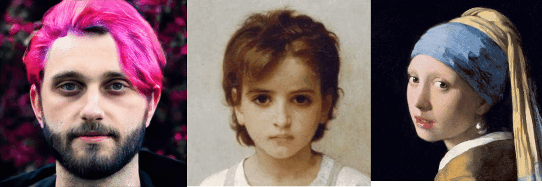
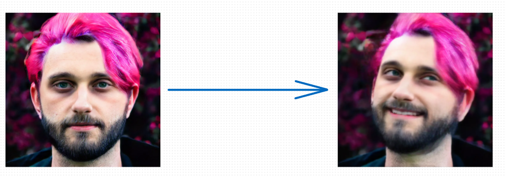
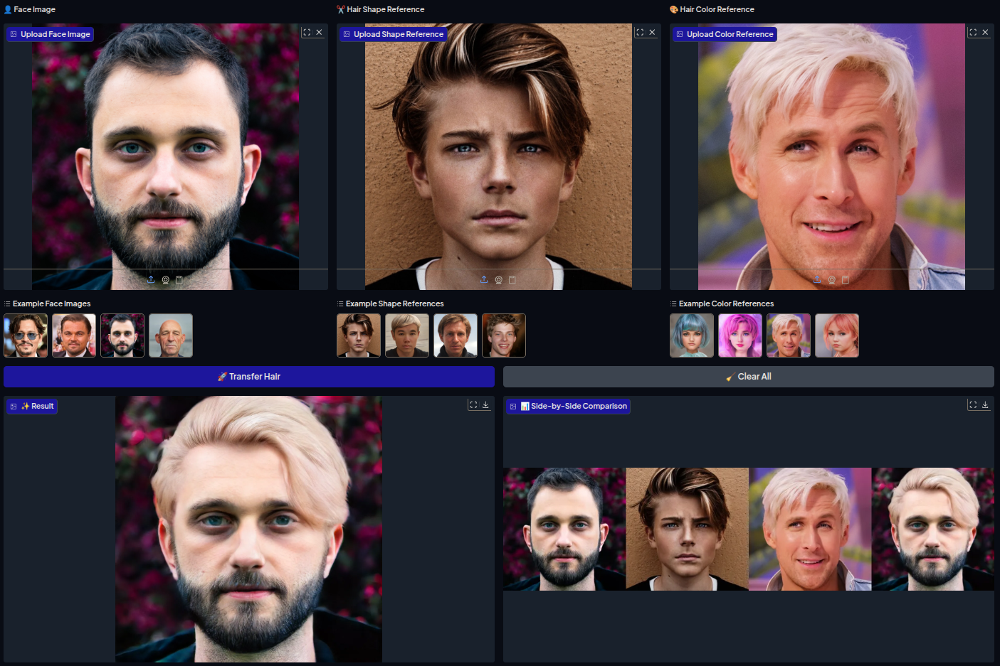
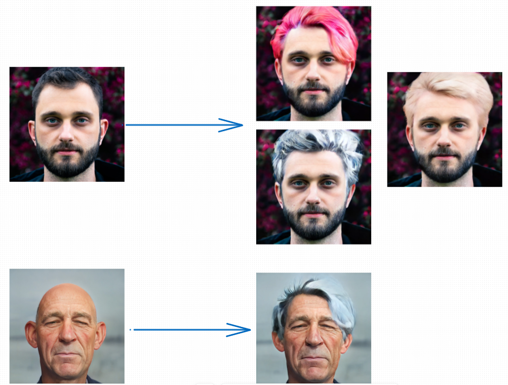
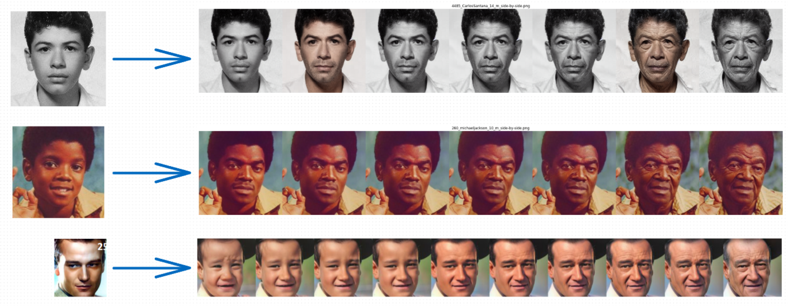

# GAN-Based Facial Attribute Manipulation

*A **GAN-based system** that manipulates facial attributes including **age, expressions, hairstyle, hair color, and head pose** to create realistic transformations in digital images.*

---
#### 1- Facial Expressions, Head Pose

<!-- ===== LivePortrait – Quick Start & Links ===== -->
<div align="center">
  <!-- 🎬 Showcase GIF -->
  <p></p>

  <!-- 🖼️ Image below the GIF -->
  <p>
    
  </p>

</div>

---
#### 2- Hairstyle, Hair Color

<div align="center">
  <p>
    
  </p>

  <p>
    
  </p>

</div>


---
#### 3- AGE

<!-- ===== LivePortrait – Quick Start & Links ===== -->
<div align="center">
  <!-- 🖼️ Image below the GIF -->
  <p>
    
  </p>

</div>

---

## Models Used

### 1. SelfAge - Age Transformation
**Paper:** "SelfAge: Personalized Facial Age Transformation Using Self-reference Images"
- **Architecture:** Diffusion-based model (Stable Diffusion v1.5 with LoRA)
- **Repository:** https://github.com/shiiiijp/SelfAge
- **Inference Method:** Command-line script
- **Key Features:**
  - Integer age specification (20, 30, 40, 50, 60, 70, 80)
  - Uses pre-trained personalized weights (e.g., MorganFreeman)
  - DDIM inversion + Null-text optimization
  - Side-by-side output comparison

### 2. HairFastGAN - Hair Style & Color
**Paper:** "HairFastGAN: Realistic and Robust Hair Transfer with a Fast Encoder-Based Approach"
- **Architecture:** StyleGAN-based encoder framework
- **Repository:** https://github.com/AIRI-Institute/HairFastGAN
- **Interface:** Gradio web application
- **Key Features:**
  - Two modes: Full Transfer (separate shape/color) and Quick Transfer (same reference)
  - Real-time processing (~1 second)
  - Interactive web interface with example images

### 3. LivePortrait - Facial Expression & Head Pose
**Paper:** "LivePortrait: Efficient Portrait Animation with Stitching and Retargeting Control"
- **Repository:** https://github.com/AbdoTW/Facial-Attribute-Manipulation-GANs
- **Interface:** Gradio web application
- **Key Features:**
  - Two modes: Portrait Animation (video-driven) and Expression Editor (slider-based)
  - Real-time slider controls for head pose, eyes, and mouth
  - Video animation from driving videos

## Project Structure
```
├── assets
│   ├── code 
│   │   ├── age.ipynb                              # Age transformation (CLI-based)
│   │   ├── Facial_expressions_Head_pose.ipynb     # Expression/pose (Gradio)
│   │   └── Hair_style_Hair_color.ipynb            # Hair modifications (Gradio)
```

## Usage

### Requirements
- Kaggle environment with **GPU P100** enabled
- All notebooks ready to run directly
- Pre-trained model weights downloaded automatically

### Running the Models

#### 1. Age Transformation (CLI-based)
Open `age.ipynb` on Kaggle:
```bash
# Enable GPU P100 in Kaggle settings
# Run notebook cells to:
# 1. Clone SelfAge repository
# 2. Download pre-trained weights
# 3. Run age editing script

python scripts/age_editing.py \
    --data_path=/kaggle/working/test_images \
    --gender=male \
    --exp_dir=/kaggle/working/output \
    --personalized_path=pretrained_model/selfage_trained_weights/MorganFreeman/pytorch_lora_weights.safetensors \
    --target_age=20,30,40,50,60,70,80 \
    --side_by_side
```

**Note:** Age model runs via command-line script without Gradio interface. Results are saved to output directory.

#### 2. Hair Style & Color (Gradio)
Open `Hair_style_Hair_color.ipynb` on Kaggle:
```bash
# Enable GPU P100
# Run notebook cells to launch Gradio interface

python app.py --share
```

**Features:**
- **Full Hair Transfer Tab:** Upload face, shape reference, and color reference separately
- **Quick Transfer Tab:** Upload face and single reference (for both shape and color)
- Interactive web interface with real-time results

#### 3. Facial Expression & Head Pose (Gradio)
Open `Facial_expressions_Head_pose.ipynb` on Kaggle:
```bash
# Enable GPU P100
# Run notebook cells to launch Gradio interface

python updated_app.py --share
```

**Features:**
- **Portrait Animation Tab:** Animate face image with driving video
- **Expression Editor Tab:** Use sliders to adjust:
  - Head pose (pitch, yaw, roll, position)
  - Eyes (eyebrow, wink, gaze direction)
  - Mouth (smile, lip movements, expressions)

## Implementation Details

### SelfAge (Age)
- **Inference:** Pre-trained LoRA weights + Stable Diffusion v1.5
- **Process:** DDIM inversion → Null-text optimization → Age editing
- **Output:** Side-by-side comparison images at multiple target ages


### HairFastGAN (Hair)
- **Inference:** Pre-trained encoders in StyleGAN FS space
- **Four-stage pipeline:**
  1. Pose Alignment (Rotate Encoder)
  2. Shape Alignment (F-space editing with SEAN inpainting)
  3. Color Alignment (S-space with CLIP embeddings)
  4. Refinement (64×64 F-space detail recovery)


### LivePortrait (Expression/Pose)
- **Inference:** Pre-trained implicit-keypoint model
- **Process:** 3D keypoint extraction → Optical flow warping → Generation

## Key Advantages

- **Interactive Interfaces:** HairFastGAN and LivePortrait have user-friendly Gradio UIs
- **High Quality:** State-of-the-art results in their respective tasks
- **Fast Inference:** HairFastGAN (<1s) and LivePortrait (12.8ms/frame)
- **Flexible Control:** Independent control over different attributes

## Gradio Interfaces

### HairFastGAN Interface
- Upload face image, hair shape reference, and color reference
- Default parameters: mixing=0.95, smooth=5
- Side-by-side comparison view
- Example images provided

### LivePortrait Interface
- **Animation Mode:** Upload face + driving video → animated result
- **Expression Editor:** 17 sliders for precise control
  - Head: pitch, yaw, roll, x/y/z movement
  - Eyes: eyebrow, wink, gaze (horizontal/vertical)
  - Mouth: 5 lip controls + smile
- Reset button to restore default values
- Real-time preview

## Results
All input images and generated results are stored in the repository for reference.


